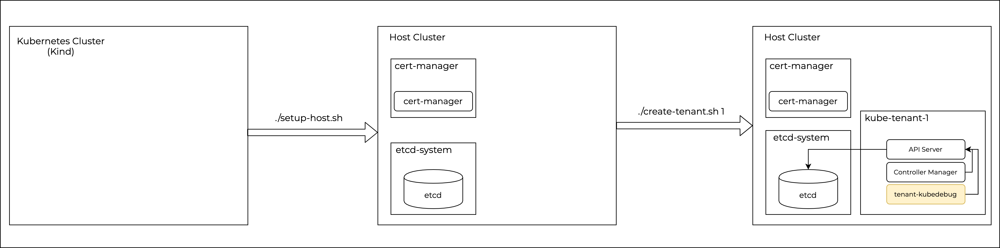

# kube-control-plane

This repository contains demo files used in the talk: **Kubernetes as a General Purpose Control Plane: Scaling on Kubernetes**



## Usage

1. Setup host cluster

```
./setup-host.sh
```

This will stand up a kind cluster locally and then deploy etcd and cert manager.


2. Create tenants with id's

```
./create-tenant.sh 1
```

This will deploy kubernetes API server and controller manager as required controller enabled by properly provisioning required certificates. It will also deploy a pod (tenant-kubedebug) for debugging/demonstration purposes.
